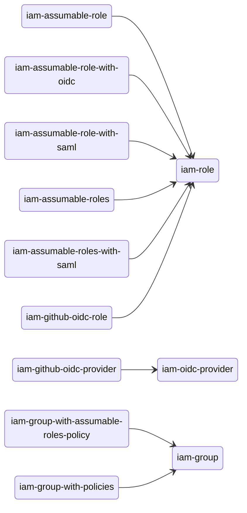

# Upgrade from v5.x to v6.x

If you have any questions regarding this upgrade process, please consult the [`examples`](https://github.com/terraform-aws-modules/terraform-aws-iam/tree/master/examples/) directory:

If you find a bug, please open an issue with supporting configuration to reproduce.

## List of backwards incompatible changes

- `iam-account`:
    - The `aws_caller_identity` data source and associated outputs have been removed. Users should instead use the data source directly in their configuration
- `iam-assumable-role` has been renamed to `iam-role`
- `iam-assumable-role-with-oidc` has been merged into `iam-role`
- `iam-assumable-role-with-saml` has been merged into `iam-role`
- `iam-assumable-roles` has been removed; `iam-role` should be used instead
- `iam-assumable-roles-with-saml` has been removed; `iam-role` should be used instead
- `iam-github-oidc-provider` has been renamed to `iam-oidc-provider`
- `iam-github-oidc-role` has been merged into `iam-role`
- `iam-group-with-policies` has been renamed to `iam-group`
- `iam-group-with-assumable-roles-policy` has been merged into `iam-group`
- `iam-eks-role` has been removed; `iam-role-for-service-accounts` or [`eks-pod-identity`](https://github.com/terraform-aws-modules/terraform-aws-eks-pod-identity) should be used instead
- `iam-policy` has been removed; the `aws_iam_policy` resource should be used directly instead
- `iam-role-for-service-accounts`:
    - Individual policy creation and attachment has been consolidated under one policy creation and attachment
    - Default values that enable permissive permissions have been removed; users will need to be explicit about the scope of access (i.e. ARNs) they provide when enabling permissions
    - AppMesh policy support has been removed due to service reaching end of support



## Additional changes

### Modified

- `iam-role`
    - The use of individual variables to control/manipulate the assume role trust policy have been replaced by a generic `assume_role_policy_statements` variable. This allows for any number of custom statements to be added to the role's trust policy.
    - `custom_role_policy_arns` has been renamed to `policies` and now accepts a map of `name`: `policy-arn` pairs; this allows for both existing policies and policies that will get created at the same time as the role. This also replaces the admin, readonly, and poweruser policy ARN variables and their associated `attach_*_policy` variables.
    - Default create conditional is now `true` instead of `false`
    - `force_detach_policies` has been removed; this is now always `true`
- `iam-group`
    - Policy management has been updated to support extending the policy created by the sub-module, as well as adding additional policies that will be attached to the group
    - The role assumption permissions has been removed from the policy; users can extend the policy to add this if needed via `permission_statements`
    - Default create conditional is now `true` instead of `false`

### Variable and output changes

1. Removed variables:

    - `iam-account`
        - `get_caller_identity`
    - `iam-role`
        - `trusted_role_actions`
        - `trusted_role_arns`
        - `trusted_role_services`
        - `mfa_age`
        - `role_requires_mfa`
        - `custom_role_trust_policy`
        - `number_of_custom_role_policy_arns`
        - `admin_role_policy_arn` & `attach_admin_policy`
        - `poweruser_role_policy_arn` & `attach_poweruser_policy`
        - `readonly_role_policy_arn` & `attach_readonly_policy`
        - `force_detach_policies`
        - `role_sts_externalid`
    - `iam-group`
        - `custom_group_policies`
        - `assumable_roles`
    - `iam-oidc-provider`
        - `additional_thumbprints` - no longer required by GitHub
    - `iam-role-for-service-accounts`
        - `cluster_autoscaler_cluster_ids` - use `cluster_autoscaler_cluster_names` instead
        - `role_name_prefix` - functionality covered under `name`
        - `policy_name_prefix` - functionality covered under `policy_name`
        - `allow_self_assume_role`
        - `attach_karpenter_controller_policy`
        - `karpenter_controller_cluster_id`
        - `karpenter_controller_cluster_name`
        - `karpenter_tag_key`
        - `karpenter_controller_ssm_parameter_arns`
        - `karpenter_controller_node_iam_role_arns`
        - `karpenter_subnet_account_id`
        - `karpenter_sqs_queue_arn`
        - `enable_karpenter_instance_profile_creation`
        - `attach_appmesh_controller_policy`
        - `attach_appmesh_envoy_proxy_policy`

2. Renamed variables:

    - `iam-role`
        - `create_role` -> `create`
        - `role_name` -> `name`
        - `role_name_prefix` -> `name_prefix`
        - `role_description` -> `description`
        - `role_path` -> `path`
        - `role_permissions_boundary_arn` -> `permissions_boundary_arn`
        - `custom_role_policy_arns` -> `policies`
    - `iam-group`
        - `create_group` -> `create`
        - `group_users` -> `group`
        - `custom_group_policy_arns` -> `policies`
        - `attach_iam_self_management_policy` -> `create_policy`
        - `iam_self_management_policy_name_prefix` -> `policy_name_prefix`
        - `aws_account_id` -> `users_account_id`
    - `iam-read-only-policy`
        - `name_prefix` (string) -> `use_name_prefix` (bool)
    - `iam-role-for-service-accounts`
        - `create_role` -> `create`
        - `role_name` -> `name`
        - `role_path` -> `path`
        - `role_name_prefix` (string) -> `use_name_prefix` (bool)
        - `role_permissions_boundary_arn` -> `permissions_boundary`
        - `role_description` -> `description`
        - `role_policy_arns` -> `policies`
        - `ebs_csi_kms_cmk_ids` -> `ebs_csi_kms_cmk_arns`
    - `iam-user`
        - `create_user` -> `create`
        - `create_iam_user_login_profile` -> `create_login_profile`
        - `create_iam_access_key` -> `create_access_key`
        - `iam_access_key_status` -> `access_key_status`
        - `policy_arns` -> `policies`
        - `upload_iam_user_ssh_key` -> `create_ssh_key`

3. Added variables:

    - `iam-account`
        - `create`
    - `iam-role`
        - `assume_role_policy_statements` which allows for any number of custom statements to be added to the role's trust policy. This covers the majority of the variables that were removed
    - `iam-group`
        - `permission_statements` which allows for any number of custom statements to be added to the role's trust policy. This covers the majority of the variables that were removed
        - `path`/`policy_path`
        - `create_policy`
        - `enable_mfa_enforcment`
    - `iam-read-only-policy`
        - `create`
    - `iam-role-for-service-accounts`
        - `create_policy`
        - `source_policy_documents`
        - `override_policy_documents`
        - `policy_statements`
        - `policy_name`
        - `policy_description`

4. Removed outputs:

    - `iam-account`
        - `caller_identity_account_id`
        - `caller_identity_arn`
        - `caller_identity_user_id`
    - `iam-role`
        - `iam_role_path`
        - `role_requires_mfa`
        - `iam_instance_profile_path`
        - `role_sts_externalid`
    - `iam-group`
        - `assumable_roles`
        - `aws_account_id`
    - `iam-read-only-policy`
        - `description`
        - `path`
    - `iam-user`
        - `pgp_key`
        - `keybase_password_decrypt_command`
        - `keybase_password_pgp_message`
        - `keybase_secret_key_decrypt_command`
        - `keybase_secret_key_pgp_message`
        - `keybase_ses_smtp_password_v4_decrypt_command`
        - `keybase_ses_smtp_password_v4_pgp_message`
        - `policy_arns`

5. Renamed outputs:

    - `iam-role`
        - `iam_role_arn` -> `arn`
        - `iam_role_name` -> `name`
        - `iam_role_unique_id` -> `unique_id`
        - `iam_instance_profile_arn` -> `instance_profile_arn`
        - `iam_instance_profile_id` -> `instance_profile_id`
        - `iam_instance_profile_name` -> `instance_profile_name`
        - `iam_instance_profile_unique_id` -> `instance_profile_unique_id`
    - `iam-group`
        - `group_id` -> `id`
        - `group_name` -> `name`
        - `group_arn` -> `arn`
        - `group_users` -> `users`
    - `iam-user`
        - `iam_user_arn` -> `arn`
        - `iam_user_name` -> `name`
        - `iam_user_unique_id` -> `unique_id`
        - `iam_user_login_profile_password` -> `login_profile_password`
        - `iam_user_login_profile_key_fingerprint` -> `login_profile_key_fingerprint`
        - `iam_user_login_profile_encrypted_password` -> `login_profile_encrypted_password`
        - `iam_access_key_id` -> `access_key_id`
        - `iam_access_key_secret` -> `access_key_secret`
        - `iam_access_key_key_fingerprint` -> `access_key_key_fingerprint`
        - `iam_access_key_encrypted_secret` -> `access_key_encrypted_secret`
        - `iam_access_key_ses_smtp_password_v4` -> `access_key_ses_smtp_password_v4`
        - `iam_access_key_encrypted_ses_smtp_password_v4` -> `access_key_encrypted_ses_smtp_password_v4`
        - `iam_access_key_status` -> `access_key_status`
        - `iam_user_ssh_key_ssh_public_key_id` -> `ssh_key_public_key_id`
        - `iam_user_ssh_key_fingerprint` -> `ssh_key_fingerprint`

6. Added outputs:

    - `iam-group`
        - `unique_id`
        - `policy_id`

### Diff of before <> after

#### `iam-account`

None


#### `iam-role`

```diff
module "iam_role" {
-  source  = "terraform-aws-modules/iam/aws//modules/iam-assumable-role"
+  source  = "terraform-aws-modules/iam/aws//modules/iam-role"
-  version = "~> 5.0"
+  version = "~> 6.0"

-  create_role = true
+  create = true # is now `true` by default

-  role_requires_mfa = true
-  trusted_role_arns = [
-    "arn:aws:iam::307990089504:root",
-    "arn:aws:iam::835367859851:user/anton",
-  ]
-  trusted_role_services = [
-    "codedeploy.amazonaws.com"
-  ]
-  role_sts_externalid = ["some-id-goes-here"]
+  assume_role_policy_statements = [
+    {
+      sid = "TrustRoleAndServiceToAssume"
+      principals = [
+        {
+          type = "AWS"
+          identifiers = [
+            "arn:aws:iam::307990089504:root",
+            "arn:aws:iam::835367859851:user/anton",
+          ]
+        },
+        {
+          type = "Service"
+          identifiers = ["codedeploy.amazonaws.com"]
+        }
+      ]
+      conditions = [{
+        test     = "StringEquals"
+        variable = "sts:ExternalId"
+        values   = ["some-secret-id"]
+      }]
+    }
+  ]

-  attach_admin_policy = true
-  custom_role_policy_arns = [
-    "arn:aws:iam::aws:policy/AmazonCognitoReadOnly",
-    "arn:aws:iam::aws:policy/AlexaForBusinessFullAccess",
-    module.iam_policy.arn
-  ]
+  policies = {
+    AdministratorAccess        = "arn:aws:iam::aws:policy/AdministratorAccess"
+    AmazonCognitoReadOnly      = "arn:aws:iam::aws:policy/AmazonCognitoReadOnly"
+    AlexaForBusinessFullAccess = "arn:aws:iam::aws:policy/AlexaForBusinessFullAccess"
+    custom                     = module.iam_policy.arn
+  }
}

### State Changes

None
