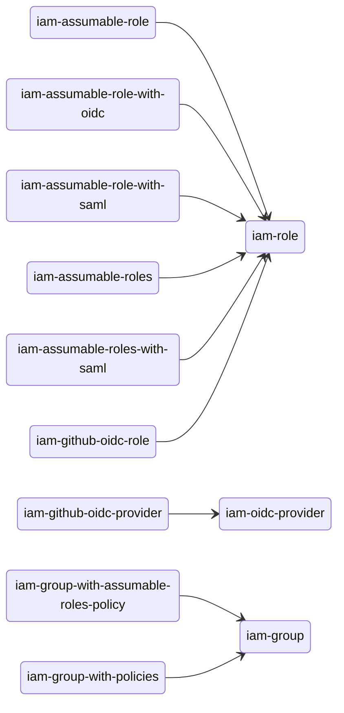

# Upgrade from v5.x to v6.x

If you have any questions regarding this upgrade process, please consult the [`examples`](https://github.com/terraform-aws-modules/terraform-aws-iam/tree/master/examples/) directory:

If you find a bug, please open an issue with supporting configuration to reproduce.

## List of backwards incompatible changes

- Terraform `v1.5.7` is now minimum supported version
- AWS provider `v6.0.0` is now minimum supported version
- The ability to allow roles to assume their own roles has been removed. This was previously added as part of helping users mitigate https://aws.amazon.com/blogs/security/announcing-an-update-to-iam-role-trust-policy-behavior/. Going forward, users will need to mitigate this on the application side (i.e. - do not have a role assume itself), or update the trust policy in their implementation to continue using this behavior. It is strongly recommended to mitigate this by not having the role assume itself.

- `iam-account`:
    - The `aws_caller_identity` data source and associated outputs have been removed. Users should instead use the data source directly in their configuration
- `iam-assumable-role` has been renamed to `iam-role`
- `iam-assumable-role-with-oidc` has been merged into `iam-role`
- `iam-assumable-role-with-saml` has been merged into `iam-role`
- `iam-assumable-roles` has been removed; `iam-role` should be used instead
- `iam-assumable-roles-with-saml` has been removed; `iam-role` should be used instead
- `iam-github-oidc-provider` has been renamed to `iam-oidc-provider`
- `iam-github-oidc-role` has been merged into `iam-role`
- `iam-group-with-policies` has been renamed to `iam-group`
- `iam-group-with-assumable-roles-policy` has been merged into `iam-group`
- `iam-eks-role` has been removed; `iam-role-for-service-accounts` or [`eks-pod-identity`](https://github.com/terraform-aws-modules/terraform-aws-eks-pod-identity) should be used instead
- `iam-role-for-service-accounts-eks` has been renamed to `iam-role-for-service-accounts`
    - Individual policy creation and attachment has been consolidated under one policy creation and attachment
    - Default values that enable permissive permissions have been removed; users will need to be explicit about the scope of access (i.e. ARNs) they provide when enabling permissions
    - AppMesh policy support has been removed due to service reaching end of support

### Module Consolidation Map



## Additional changes

### Modified

- Variable definitions now contain detailed `object` types in place of the previously used any type

- `iam-group`
    - Policy management has been updated to support extending the policy created by the sub-module, as well as adding additional policies that will be attached to the group
    - The role assumption permissions has been removed from the policy; users can extend the policy to add this if needed via `permissions`
    - Default create conditional is now `true` instead of `false`
- `iam-role`
    - The use of individual variables to control/manipulate the assume role trust policy have been replaced by a generic `trust_policy_permissions` variable. This allows for any number of custom statements to be added to the role's trust policy.
    - `custom_role_policy_arns` has been renamed to `policies` and now accepts a map of `name`: `policy-arn` pairs; this allows for both existing policies and policies that will get created at the same time as the role. This also replaces the admin, readonly, and poweruser policy ARN variables and their associated `attach_*_policy` variables.
    - Default create conditional is now `true` instead of `false`
    - `force_detach_policies` has been removed; this is now always `true`
    - Support for inline policies has been added
- `iam-role-for-service-accounts`
    - Support for inline policies has been added

### Variable and output changes

1. Removed variables:

    - `iam-account`
        - `get_caller_identity`
    - `iam-group`
        - `custom_group_policies`
        - `assumable_roles`
    - `iam-oidc-provider`
        - `additional_thumbprints` - no longer required by GitHub
    - `iam-policy`
        - None
    - `iam-read-only-policy`
        - `additional_policy_json` - use `source_inline_policy_documents` or `override_inline_policy_documents` instead
    - `iam-role`
        - `trusted_role_actions`
        - `trusted_role_arns`
        - `trusted_role_services`
        - `mfa_age`
        - `role_requires_mfa`
        - `custom_role_trust_policy`
        - `number_of_custom_role_policy_arns`
        - `admin_role_policy_arn` & `attach_admin_policy`
        - `poweruser_role_policy_arn` & `attach_poweruser_policy`
        - `readonly_role_policy_arn` & `attach_readonly_policy`
        - `force_detach_policies`
        - `role_sts_externalid`
    - `iam-role-for-service-accounts`
        - `cluster_autoscaler_cluster_ids` - use `cluster_autoscaler_cluster_names` instead
        - `role_name_prefix` - functionality covered under `name`
        - `policy_name_prefix` - functionality covered under `policy_name`
        - `allow_self_assume_role`
        - `attach_karpenter_controller_policy`
        - `karpenter_controller_cluster_id`
        - `karpenter_controller_cluster_name`
        - `karpenter_tag_key`
        - `karpenter_controller_ssm_parameter_arns`
        - `karpenter_controller_node_iam_role_arns`
        - `karpenter_subnet_account_id`
        - `karpenter_sqs_queue_arn`
        - `enable_karpenter_instance_profile_creation`
        - `attach_appmesh_controller_policy`
        - `attach_appmesh_envoy_proxy_policy`
    - `iam-user`
        - None

2. Renamed variables:

    - `iam-account`
        - None
    - `iam-group`
        - `create_group` -> `create`
        - `group_users` -> `users`
        - `custom_group_policy_arns` -> `policies`
        - `attach_iam_self_management_policy` -> `create_policy`
        - `iam_self_management_policy_name_prefix` -> `policy_name_prefix`
        - `aws_account_id` -> `users_account_id`
    - `iam-oidc-provider`
        - None
    - `iam-policy`
        - `create_policy` -> `create`
    - `iam-read-only-policy`
        - `name_prefix` (string) -> `use_name_prefix` (bool)
    - `iam-role`
        - `create_role` -> `create`
        - `role_name` -> `name`
        - `role_name_prefix` -> `name_prefix`
        - `role_description` -> `description`
        - `role_path` -> `path`
        - `role_permissions_boundary_arn` -> `permissions_boundary_arn`
        - `custom_role_policy_arns` -> `policies`
    - `iam-role-for-service-accounts`
        - `create_role` -> `create`
        - `role_name` -> `name`
        - `role_path` -> `path`
        - `role_name_prefix` (string) -> `use_name_prefix` (bool)
        - `role_permissions_boundary_arn` -> `permissions_boundary`
        - `role_description` -> `description`
        - `role_policy_arns` -> `policies`
        - `ebs_csi_kms_cmk_ids` -> `ebs_csi_kms_cmk_arns`
        - `assume_role_condition_test` -> `trust_condition_test`
    - `iam-user`
        - `create_user` -> `create`
        - `create_iam_user_login_profile` -> `create_login_profile`
        - `create_iam_access_key` -> `create_access_key`
        - `iam_access_key_status` -> `access_key_status`
        - `policy_arns` -> `policies`
        - `upload_iam_user_ssh_key` -> `create_ssh_key`

3. Added variables:

    - `iam-account`
        - `create`
    - `iam-group`
        - `permissions` which allows for any number of custom statements to be added to the role's trust policy. This covers the majority of the variables that were removed
        - `path`/`policy_path`
        - `create_policy`
        - `enable_mfa_enforcment`
    - `iam-oidc-provider`
        - None
    - `iam-policy`
        - None
    - `iam-read-only-policy`
        - `create`
        - `source_policy_documents`
        - `override_policy_documents`
    - `iam-role`
        - `trust_policy_permissions` which allows for any number of custom statements to be added to the role's trust policy. This covers the majority of the variables that were removed
        - `trust_policy_conditions`
        - `create_inline_policy`
        - `source_inline_policy_documents`
        - `override_inline_policy_documents`
        - `inline_policy_permissions`
    - `iam-role-for-service-accounts`
        - `create_policy`
        - `source_policy_documents`
        - `override_policy_documents`
        - `permissions`
        - `policy_name`
        - `policy_description`
        - `create_inline_policy`
        - `source_inline_policy_documents`
        - `override_inline_policy_documents`
        - `inline_policy_permissions`
    - `iam-user`
        - None

4. Removed outputs:

    - `iam-account`
        - `caller_identity_account_id`
        - `caller_identity_arn`
        - `caller_identity_user_id`
    - `iam-group`
        - `assumable_roles`
        - `aws_account_id`
    - `iam-oidc-provider`
        - None
    - `iam-policy`
        - `description`
        - `path`
    - `iam-read-only-policy`
        - `description`
        - `path`
    - `iam-role`
        - `iam_role_path`
        - `role_requires_mfa`
        - `iam_instance_profile_path`
        - `role_sts_externalid`
    - `iam-role-for-service-accounts`
        - None
    - `iam-user`
        - `pgp_key`
        - `keybase_password_decrypt_command`
        - `keybase_password_pgp_message`
        - `keybase_secret_key_decrypt_command`
        - `keybase_secret_key_pgp_message`
        - `keybase_ses_smtp_password_v4_decrypt_command`
        - `keybase_ses_smtp_password_v4_pgp_message`
        - `policy_arns`

5. Renamed outputs:

    - `iam-account`
        - None
    - `iam-group`
        - `group_id` -> `id`
        - `group_name` -> `name`
        - `group_arn` -> `arn`
        - `group_users` -> `users`
    - `iam-oidc-provider`
        - None
    - `iam-policy`
        - None
    - `iam-read-only-policy`
        - None
    - `iam-role`
        - `iam_role_arn` -> `arn`
        - `iam_role_name` -> `name`
        - `iam_role_unique_id` -> `unique_id`
        - `iam_instance_profile_arn` -> `instance_profile_arn`
        - `iam_instance_profile_id` -> `instance_profile_id`
        - `iam_instance_profile_name` -> `instance_profile_name`
        - `iam_instance_profile_unique_id` -> `instance_profile_unique_id`
    - `iam-role-for-service-accounts`
        - None
    - `iam-user`
        - `iam_user_arn` -> `arn`
        - `iam_user_name` -> `name`
        - `iam_user_unique_id` -> `unique_id`
        - `iam_user_login_profile_password` -> `login_profile_password`
        - `iam_user_login_profile_key_fingerprint` -> `login_profile_key_fingerprint`
        - `iam_user_login_profile_encrypted_password` -> `login_profile_encrypted_password`
        - `iam_access_key_id` -> `access_key_id`
        - `iam_access_key_secret` -> `access_key_secret`
        - `iam_access_key_key_fingerprint` -> `access_key_key_fingerprint`
        - `iam_access_key_encrypted_secret` -> `access_key_encrypted_secret`
        - `iam_access_key_ses_smtp_password_v4` -> `access_key_ses_smtp_password_v4`
        - `iam_access_key_encrypted_ses_smtp_password_v4` -> `access_key_encrypted_ses_smtp_password_v4`
        - `iam_access_key_status` -> `access_key_status`
        - `iam_user_ssh_key_ssh_public_key_id` -> `ssh_key_public_key_id`
        - `iam_user_ssh_key_fingerprint` -> `ssh_key_fingerprint`

6. Added outputs:

    - `iam-group`
        - `unique_id`
        - `policy_id`

### Diff of before <> after

> [!WARNING]
> Renamed variables are not exhaustively shown below. See sections above for mappings of renamed variables

#### `iam-account`

None

#### `iam-assumable-role` -> `iam-role`

```diff
module "iam_role" {
-  source  = "terraform-aws-modules/iam/aws//modules/iam-assumable-role"
+  source  = "terraform-aws-modules/iam/aws//modules/iam-role"
-  version = "~> 5.60"
+  version = "~> 6.0"

-  create_role = true
+  create = true # is now `true` by default

-  trusted_role_arns = [
-    "arn:aws:iam::307990089504:root",
-    "arn:aws:iam::835367859851:user/anton",
-  ]
-  trusted_role_services = [
-    "codedeploy.amazonaws.com"
-  ]
-  role_sts_externalid = ["some-id-goes-here"]
+  trust_policy_permissions = {
+    TrustRoleAndServiceToAssume = {
+      actions = [
+        "sts:AssumeRole",
+        "sts:TagSession",
+      ]
+      principals = [
+        {
+          type = "AWS"
+          identifiers = [
+            "arn:aws:iam::307990089504:root",
+            "arn:aws:iam::835367859851:user/anton",
+          ]
+        },
+        {
+          type = "Service"
+          identifiers = ["codedeploy.amazonaws.com"]
+        }
+      ]
+      condition = [{
+        test     = "StringEquals"
+        variable = "sts:ExternalId"
+        values   = ["some-id-goes-here"]
+      }]
+    }
+  }

-  attach_admin_policy = true
-  custom_role_policy_arns = [
-    "arn:aws:iam::aws:policy/AmazonCognitoReadOnly",
-    "arn:aws:iam::aws:policy/AlexaForBusinessFullAccess",
-    module.iam_policy.arn
-  ]
+  policies = {
+    AdministratorAccess        = "arn:aws:iam::aws:policy/AdministratorAccess"
+    AmazonCognitoReadOnly      = "arn:aws:iam::aws:policy/AmazonCognitoReadOnly"
+    AlexaForBusinessFullAccess = "arn:aws:iam::aws:policy/AlexaForBusinessFullAccess"
+    custom                     = module.iam_policy.arn
+  }
}
```

##### State Changes

Remove all prior policy attachments (that are marked for deletion in `terraform plan`).
Policies will stay attached to the role but new attachment IDs will be created on next apply

```sh
terraform state rm module.iam_role.aws_iam_role_policy_attachment.admin
terraform state rm module.iam_role.aws_iam_role_policy_attachment.custom
```

#### `iam-assumable-role-with-oidc` -> `iam-role`

```diff
module "iam_role" {
-  source  = "terraform-aws-modules/iam/aws//modules/iam-assumable-role-with-oidc"
+  source  = "terraform-aws-modules/iam/aws//modules/iam-role"
-  version = "~> 5.60"
+  version = "~> 6.0"

+  enable_oidc = true

-  provider_url = "oidc.circleci.com/org/<CIRCLECI_ORG_UUID>"
+  oidc_provider_urls = ["oidc.circleci.com/org/<CIRCLECI_ORG_UUID>"]

-  oidc_fully_qualified_audiences = ["<CIRCLECI_ORG_UUID>"]
+  oidc_audiences = ["<CIRCLECI_ORG_UUID>"]

-  role_policy_arns = [
-    "arn:aws:iam::aws:policy/AmazonEC2ContainerRegistryPowerUser",
-  ]
+  policies = {
+    AmazonEC2ContainerRegistryPowerUser = "arn:aws:iam::aws:policy/AmazonEC2ContainerRegistryPowerUser"
+  }

-  provider_trust_policy_conditions = [
+  trust_policy_conditions = [
    {
      test     = "StringLike"
      variable = "aws:RequestTag/Environment"
      values   = ["example"]
    }
  ]
}
```

##### State Changes

Remove all prior policy attachments (that are marked for deletion in `terraform plan`).
Policies will stay attached to the role but new attachment IDs will be created on next apply

```sh
terraform state rm module.iam_role.aws_iam_role_policy_attachment.custom
```

#### `iam-assumable-role-with-saml` -> `iam-role`

```diff
module "iam_role" {
-  source  = "terraform-aws-modules/iam/aws//modules/iam-assumable-role-with-saml"
+  source  = "terraform-aws-modules/iam/aws//modules/iam-role"
-  version = "~> 5.60"
+  version = "~> 6.0"

+  enable_saml       = true
-  provider_id  = aws_iam_saml_provider.idp_saml.id
-  provider_ids = [aws_iam_saml_provider.second_idp_saml.id]
+  saml_provider_ids = [
+    aws_iam_saml_provider.idp_saml.id,
+    aws_iam_saml_provider.second_idp_saml.id
+  ]

-  role_policy_arns = [
-    "arn:aws:iam::aws:policy/ReadOnlyAccess",
-  ]
+  policies = {
+    ReadOnlyAccess = "arn:aws:iam::aws:policy/ReadOnlyAccess"
+  }
}

resource "aws_iam_saml_provider" "idp_saml" {
  name                   = "idp_saml"
  saml_metadata_document = file("saml-metadata.xml")
}

resource "aws_iam_saml_provider" "second_idp_saml" {
  name                   = "second_idp_saml"
  saml_metadata_document = file("saml-metadata.xml")
}
```

##### State Changes

Remove all prior policy attachments (that are marked for deletion in `terraform plan`).
Policies will stay attached to the role but new attachment IDs will be created on next apply

```sh
terraform state rm module.iam_role.aws_iam_role_policy_attachment.custom
```

#### `iam-assumable-roles` -> `iam-role`

This migration is a bit more involved since its going from a module of multiple roles, to a module with one role.

##### Before `v5.60`

```hcl
module "iam_assumable_roles" {
  source  = "terraform-aws-modules/iam/aws//modules/iam-assumable-roles"
  version = "~> 5.60"

  trusted_role_arns = [
    "arn:aws:iam::307990089504:root",
    "arn:aws:iam::835367859851:user/anton",
  ]

  trusted_role_services = [
    "codedeploy.amazonaws.com"
  ]

  create_admin_role = true

  create_poweruser_role      = true
  poweruser_role_name        = "Billing-And-Support-Access"
  poweruser_role_policy_arns = [
    "arn:aws:iam::aws:policy/job-function/Billing",
    "arn:aws:iam::aws:policy/AWSSupportAccess",
  ]
}
```

##### After `v6.0`

```hcl
module "iam_role_admin" {
  source  = "terraform-aws-modules/iam/aws//modules/iam-role"
  version = "~> 6.0"

  name = "admin"

  trust_policy_permissions = {
    TrustRoleAndServiceToAssume = {
      actions = [
        "sts:AssumeRole",
        "sts:TagSession",
      ]
      principals = [
        {
          type = "AWS"
          identifiers = [
            "arn:aws:iam::307990089504:root",
            "arn:aws:iam::835367859851:user/anton",
          ]
        },
        {
          type = "Service"
          identifiers = ["codedeploy.amazonaws.com"]
        }
      ]
    }
  }

  policies = {
    AdministratorAccess = "arn:aws:iam::aws:policy/AdministratorAccess"
  }
}

module "iam_role_poweruser" {
  source  = "terraform-aws-modules/iam/aws//modules/iam-role"
  version = "~> 6.0"

  name = "Billing-And-Support-Access"

  trust_policy_permissions = {
    TrustRoleAndServiceToAssume = {
      actions = [
        "sts:AssumeRole",
        "sts:TagSession",
      ]
      principals = [
        {
          type = "AWS"
          identifiers = [
            "arn:aws:iam::307990089504:root",
            "arn:aws:iam::835367859851:user/anton",
          ]
        },
        {
          type = "Service"
          identifiers = ["codedeploy.amazonaws.com"]
        }
      ]
    }
  }

  policies = {
    PowerUserAccess = "arn:aws:iam::aws:policy/PowerUserAccess"
    Billing = "arn:aws:iam::aws:policy/job-function/Billing"
    AWSSupportAccess = "arn:aws:iam::aws:policy/AWSSupportAccess"
  }
}
```

##### State Changes

Remove all prior policy attachments (that are marked for deletion in `terraform plan`).
Policies will stay attached to the role but new attachment IDs will be created on next apply

```sh
terraform state mv "module.iam_assumable_roles.aws_iam_role.admin[0]" "module.iam_role_admin.aws_iam_role.this[0]"
terraform state rm module.iam_assumable_roles.aws_iam_role_policy_attachment.admin

terraform state mv "module.iam_assumable_roles.aws_iam_role.poweruser[0]" "module.iam_role_poweruser.aws_iam_role.this[0]"
terraform state rm module.iam_assumable_roles.aws_iam_role_policy_attachment.poweruser
```

#### `iam-assumable-roles-with-saml` -> `iam-role`

This migration is a bit more involved since its going from a module of multiple roles, to a module with one role.

##### Before `v5.60`

```hcl
module "iam_assumable_roles" {
  source  = "terraform-aws-modules/iam/aws//modules/iam-assumable-roles-with-saml"
  version = "~> 5.60"

  create_admin_role = true

  create_poweruser_role = true
  poweruser_role_name   = "developer"

  provider_id  = aws_iam_saml_provider.idp_saml.id
  provider_ids = [aws_iam_saml_provider.idp_saml.id, aws_iam_saml_provider.second_idp_saml.id]
}

resource "aws_iam_saml_provider" "idp_saml" {
  name                   = "idp_saml"
  saml_metadata_document = file("saml-metadata.xml")
}

resource "aws_iam_saml_provider" "second_idp_saml" {
  name                   = "second_idp_saml"
  saml_metadata_document = file("saml-metadata.xml")
}
```

##### After `v6.0`

```hcl
module "iam_role_admin" {
  source  = "terraform-aws-modules/iam/aws//modules/iam-role"
  version = "~> 6.0"

  name = "admin"

  enable_saml       = true
  saml_provider_ids = [
    aws_iam_saml_provider.idp_saml.id,
    aws_iam_saml_provider.second_idp_saml.id
  ]

  policies = {
    AdministratorAccess = "arn:aws:iam::aws:policy/AdministratorAccess"
  }
}

module "iam_role_poweruser" {
  source  = "terraform-aws-modules/iam/aws//modules/iam-role"
  version = "~> 6.0"

  name = "poweruser"

  enable_saml       = true
  saml_provider_ids = [
    aws_iam_saml_provider.idp_saml.id,
    aws_iam_saml_provider.second_idp_saml.id
  ]

  policies = {
    PowerUserAccess = "arn:aws:iam::aws:policy/PowerUserAccess"
  }
}
```

##### State Changes

Remove all prior policy attachments (that are marked for deletion in `terraform plan`).
Policies will stay attached to the role but new attachment IDs will be created on next apply

```sh
terraform state mv "module.iam_assumable_roles.aws_iam_role.admin[0]" "module.iam_role_admin.aws_iam_role.this[0]"
terraform state rm module.iam_assumable_roles.aws_iam_role_policy_attachment.admin

terraform state mv "module.iam_assumable_roles.aws_iam_role.poweruser[0]" "module.iam_role_poweruser.aws_iam_role.this[0]"
terraform state rm module.iam_assumable_roles.aws_iam_role_policy_attachment.poweruser
```

#### `iam-eks-role` -> `iam-role-for-service-accounts`

```diff
module "irsa" {
-  source  = "terraform-aws-modules/iam/aws//modules/iam-eks-role"
+  source  = "terraform-aws-modules/iam/aws//modules/iam-role-for-service-accounts"
-  version = "~> 5.60"
+  version = "~> 6.0"

-  role_name = "example"
+  name = "example"

-  cluster_service_accounts = {
-    example = ["default:my-app"]
-  }
+  oidc_providers = {
+    example = {
+      provider_arn               = module.eks.oidc_provider_arn
+      namespace_service_accounts = ["default:my-app"]
+    }
+  }

-  role_policy_arns = {
+  policies = {
    AmazonEKS_CNI_Policy = "arn:aws:iam::aws:policy/AmazonEKS_CNI_Policy"
  }
}
```

#### `iam-github-oidc-role` -> `iam-role`

```diff
module "iam_role" {
-  source  = "terraform-aws-modules/iam/aws//modules/iam-github-oidc-role"
+  source  = "terraform-aws-modules/iam/aws//modules/iam-role"
-  version = "~> 5.60"
+  version = "~> 6.0"

+  enable_github_oidc = true

-  subjects = [
+  oidc_subjects = [
    "terraform-aws-modules/terraform-aws-iam:pull_request",
    "terraform-aws-modules/terraform-aws-iam:ref:refs/heads/master",
  ]

-  additional_trust_policy_conditions = [
+  trust_policy_conditions = [
    {
      test     = "StringEquals"
      variable = "token.actions.githubusercontent.com:actor"
      values = ["username"]
    }
  ]

  policies = {
    S3ReadOnly = "arn:aws:iam::aws:policy/AmazonS3ReadOnlyAccess"
  }
}
```

#### `iam-group-with-assumable-roles-policy` -> `iam-group`

```diff
module "iam_group" {
-  source  = "terraform-aws-modules/iam/aws//modules/iam-group-with-assumable-roles-policy"
+  source  = "terraform-aws-modules/iam/aws//modules/iam-group"
-  version = "~> 5.60"
+  version = "~> 6.0"

  # To preserve backwards compatibility
  policy_use_name_prefix             = false
  policy_description                 = "Allows to assume role in another AWS account"
  enable_self_management_permissions = false

-  assumable_roles = ["arn:aws:iam::111111111111:role/admin"]
+  permissions = {
+    AssumeRole = {
+      effect    = "Allow"
+      actions   = ["sts:AssumeRole"]
+      resources = ["arn:aws:iam::111111111111:role/admin"]
+    }
+  }

-  group_users = [
+  users = [
    module.iam_user.iam_user_name,
  ]
}

module "iam_user" {
  source  = "terraform-aws-modules/iam/aws//modules/iam-user"
  version = "~> 5.60"

  name = "user"

  create_iam_user_login_profile = false
  create_iam_access_key         = false
}
```

#### `iam-group-with-policies` -> `iam-group`

```diff
module "iam_group" {
-  source  = "terraform-aws-modules/iam/aws//modules/iam-group-with-policies"
+  source  = "terraform-aws-modules/iam/aws//modules/iam-group"
-  version = "~> 5.60"
+  version = "~> 6.0"

  # To preserve backwards compatibility
  policy_name = "IAMSelfManagement"

-  group_users = [
+  users = [
    module.iam_user.iam_user_name,
  ]

-  custom_group_policy_arns = ["arn:aws:iam::aws:policy/AmazonS3FullAccess"]
+  policies = {
+    AmazonS3FullAccess = "arn:aws:iam::aws:policy/AmazonS3FullAccess"
+  }
}

module "iam_user" {
  source  = "terraform-aws-modules/iam/aws//modules/iam-user"
  version = "~> 5.60"

  name = "user"

  create_iam_user_login_profile = false
  create_iam_access_key         = false
}
```

##### State Changes

Remove all prior policy attachments (that are marked for deletion in `terraform plan`).
Policies will stay attached to the role but new attachment IDs will be created on next apply

```sh
terraform state rm module.iam_group.aws_iam_group_policy_attachment.custom_arns
```

#### `iam-policy`

None

#### `iam-read-only-policy`

None

#### `iam-role-for-service-accounts`

TODO - coming soon after `v6.0.1` patch release

#### `iam-user`

```diff
module "iam_user" {
  source  = "terraform-aws-modules/iam/aws//modules/iam-user"
-  version = "~> 5.60"
+  version = "~> 6.0"

-  policy_arns = ["arn:aws:iam::aws:policy/AmazonS3ReadOnlyAccess"]
+  policies = {
+    S3ReadOnly = "arn:aws:iam::aws:policy/AmazonS3ReadOnlyAccess"
+  }
}
```

##### State Changes

Remove all prior policy attachments (that are marked for deletion in `terraform plan`).
Policies will stay attached to the role but new attachment IDs will be created on next apply

```sh
terraform state rm module.iam_user[0].aws_iam_user_policy_attachment.this
```
